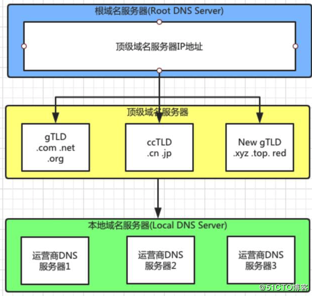
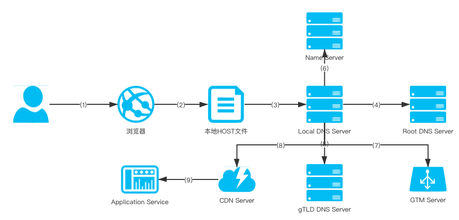
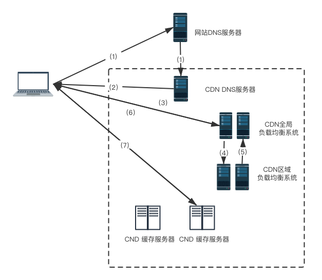

# DNS含义和结构

互联网将众多服务器关联在一起，用IP来标识一台服务器，IP地址虽然能够找到设备，但是记忆起来还是比较困难，所以需要找个好记忆和理解的方案，那就是域名。例如：www.gaoding.com 就是一个域名，通过域名解析出IP地址，IP地址用来指向网站服务器。那么谁来做这个域名到IP地址的对应呢？答案就是DNS。

在Internet前身ARPAnet的年代，整个网络就为数不多的主机，只有几百台主机，所有的主机信息以及主机名与主机地址都维护在一个HOSTS.TXT的文件中。HOST.TXT由一台名为SRI-NIC的主机分发到整个网络中，由斯坦福研究院信息中心负责维护。ARPAnet的管理员通过电子邮件的方式将变更信息通知NIC，同时定期FTP上传到SRI-NIC上，获取最新的HOST.TXT。但是到了80年代，主机数量指数级别暴增，人工维护的方式已经不适用了。1984年，南加州大学信息研究所的Paul Mockaprtric发布了描述DNS的RFC 882 和 RFC 883，就是最初的DNS规范，DNS系统诞生了。

DNS是域名系统（Domain Name System）是互联网的一项服务。它是将域名和IP地址互相映射的分布式数据库，保存着域名和IP的对照关系，从而使我们更方便地访问互联网。

DNS解析是分布式存储的，从结构上来说最底层是，根域名服务器（ROOT DNS Server），存储260个顶级域名服务器的IP地址。对于IPV4来说，全球有13个根域名服务器（每个服务器都是集群组成），大部分位于北美。它存储了每个域（.com .net .cn）的解析和域名服务器的地址信息。简单来说，根域名服务器就是存放顶级域名服务器地址的。

在根域名服务器下一级就是，顶级域名服务器。例如.com的域名服务器，存储的是一些域名的权威DNS服务器地址（toutiao.com的DNS）。

顶级域名又称一级域名，顶级域名可以分为三类，即gTLD，ccTLD和New gTLD：

- gTLD：国际顶级域名（generic top-level domain），例如：.com/.net/.org等都属于gTLD；
- ccTLD：国家和地区顶级域名（country code top-level domain），例如：中国 .cn域名，日本 .jp域名
- New gTLD：新顶级域名（New gTLD），例如：.xyz/.top/.red/.help等新顶级域名

顶级域名服务器就是根据上面三类保存域名IP对应关系的。

域名说明

- 顶级域名又称作一级域名，e.g. .com .net .org .cn等

- 二级域名就是在一级域名前再加一级，如gaoding.con

- 二级域名以上的域名，统称子域名，不在注册域名的范畴中

在顶级域名下一级就是：本地域名服务器（LocalDNS）一般是运营商的DNS，主要作用就是代理用户进行域名分析。

DNS域名服务器分为三级，从上到下分别是根域名服务器（Root DNS Server）、顶级域名服务器（gDNS, ccDNS, NEW gTLD）、本地（运营商）域名服务器（LocalDNS）。如下图所示DNS分层结构：

# DNS解析原理

下面通过用户访问网页的过程，来描述DNS解析以及获取URL到IP映射的整个过程。其中过程比较复杂，会存在信息的来回传递。以下过程中我们会简化信息来回传递的线段，重点放在信息传递的路径，通过9步来诠释DNS解析过程，用户请求与DNS解析的全过程如下图所示：

1. 用户通过浏览器请求网址，例如：www.baidu.com 。浏览器会在自己的缓存中查找URL对应的IP地址。如果之前访问过，保存这个URL对应IP地址的缓存，那么就直接访问IP地址。如果没有缓存，进入第2步。

2. 通过计算机本地HOST文件配置，可以设置URL与IP地址的映射关系。这里查找本地的Host文件，看是否IP地址的配置。如果文件中无配置，进入第3步：

3. 请求LocalDns Server，通过本地运营商获取URL和IP的映射关系。浏览器是怎么知道LocalDns Server在哪里呢？LocalDns Server是本地网络配置的一部分，或者通过DHCP方式分配给客户端。如果在校园网，DNS服务器就在校园，如果是小区网络，DNS服务器由运营商提供。总之这个服务器的物理位置上离发起请求的计算机比较近。LocalDns Server缓存了大量的DNS解析结果。由于它的性能较好，物理上的距离又比较近，它通常会在很短时间内返回制定域名的解析结果。80%的DNS解析在这一步就能满足，如果这一步还是无法完成域名解析，进入第4步：

4. 通过Root DNS Server进行解析，ROOT DNS Server会根据请求URL返回给Local DNS Server的顶级域名服务器地址。例如：查询的是.com的域名，就查询GTLD对应的域名服务器地址。

5. 返回顶级域名服务器以后，访问对应的顶级域名服务器（gTLD，ccTLD，New gTLD），并且返回Name Server服务器（也可以称作次级DNS服务器，权威域名服务器）地址。这个Name Server就是网站注册的域名服务器，上面包含了网站URL和IP的对应信息。例如你在某个域名服务服务提供商申请的域名，这个域名就由他们的服务器来解析。这个Name Server是由域名提供商维护的。

6. Name Server会把指定域名的A记录或者CNAME返回给LocalDns Server，并且设置一个TTL。

   1. A(Address)记录是用来指定主机名或者域名对应的IP地址记录。用户可以将域名指向到自己的web server上。同时可以也可以设置域名的二级域名。
   2. CNAME：别名记录。这种记录允许将多个名字映射到另外一个域名。通常用于同时提供WWW和MAIL服务的计算机。例如：有一台计算机名为“host.mydomain.com“(A记录)。它同时提供WWW和MAIL服务，为了便于用户访问服务。服务商从方便维护的角度，一般也建议用户使用CNAME记录绑定域名。当域名服务器找到一个别名，它会用记录中的规范名来替换整个域名别名，然后再查询整个域名的A记录。
   3. TTL(Time TO LIve)：也就是设置这个DNS解析在Local DNS Server上面的过期时间。超过这个过期时间，URL和IP的映射就会被删除，需要获取还要请求Name Server。

7. 如果此时获取的是A记录，那么就可以直接访问这个网站的IP。但是通常大型网站都会返回CNAME，然后将其传给GTM Server。

   GTM（Global Traffic Manager的简写）即全局流量管理，基于网宿智能DNS、分布式监控体系，实现实时故障切换及全球负载均衡，保障应用服务的持续高可用性。传给GTM的目的就是希望通过GTM的负载均衡机制，帮助用户找到最适合自己的服务器IP。

   也就是离自己最近，性能最好，服务器状态最健康的。而且大多数的网站会做CDN缓存，此时就更需要使用GTM帮你找到网络节点中适合你的CDN缓存服务器。

8. 找到CND缓存服务器以后，可以直接从服务器上面获取一些静态资源。但是一些动态资源，例如商品信息，订单信息，需要通过第9步：

9. 对于没有缓存的动态资源需要从应用服务器获取，在应用服务器和互联网之间通常有一层负载均衡负责反向代理，由它路由到应用服务器上。

# CDN用户访问流程

网站为了减少的负载压力以及提高用户访问速度等，现在主流的网站都会增加CDN，进行网络加速。在网站与用户之间加入CDN后，用户是无感知，不会有与原来有不同的感觉。典型的用CDN用户访问流程如下图所示：

1. 当用户访问网站时，点击网站内容的URL，经过本地DNS系统解析，DNS系统会最终将域名的解析交给CNAME指向的CDN专用DNS服务器。
2. CDN的DNS服务器将CDN地全局负载均衡设备IP地址返回给用户。
3. 用户向CDN的全局负载均衡设备发起内容URL访问请求。
4. CDN全局负载均衡系统根据用户IP地址，以及用户请求的URL，选择一台用户所属区域的区域负载均衡设备，告诉用户向这台设备发起请求。
5. 区域负载均衡设备会选择一台合适的缓存服务器提供服务，选择的依据包括：根据用户IP地址，选择地理位置最近的服务器；根据用户请求的URL中携带的内容名称，选择有缓存用户所需内容的服务器；查询各个服务器当前的负载情况，选择尚有服务能力的机器。根据上面的条件的综合分析之后，区域负载均衡设备会向全局负载均衡返回一台缓存服务器的IP地址。
6. 全局负载均衡设备会吧缓存服务器的IP返回给用户。
7. 用户向缓存服务器发起请求，缓存服务器响应用户请求，将用户所需内容传送给内容终端。如果这台缓存服务器并没有用户想要的内容，而区域负载均衡设备依然将它分配给用户，那么这台服务器就要向它的上一级缓存服务器请求内容，直至追溯到网站的源服务器将内容到缓存服务器，这也称作回源的过程。

# 总结

DNS服务器用来做URL和IP地址解析，帮助我们找到服务器的IP。从DNS服务器的结构来说大致分为三层：根域名服务器、顶级域名服务器、本地域名服务器。

申请域名的供应商会提供Name Server作为DNS解析。从用户访问一个网站出发，经过浏览器，本地Host，LocalDns Server, 根域名服务器，顶级域名服务器，Name Server，GTM（Global Traffic Manager），CDN，应用服务器。

CDN总是希望将离用户最近的资源来服务用户，所以就需要在全网不同地理位置部署多个节点。网站将域名CNAME给CDN系统，CDN的全局负载系统将解决多个节点互协作的问题，实现整个系统实现大规模服务能力与高可用。

# 参考资料

崔皓 https://blog.51cto.com/14279308/2481205

《CDN技术详解》