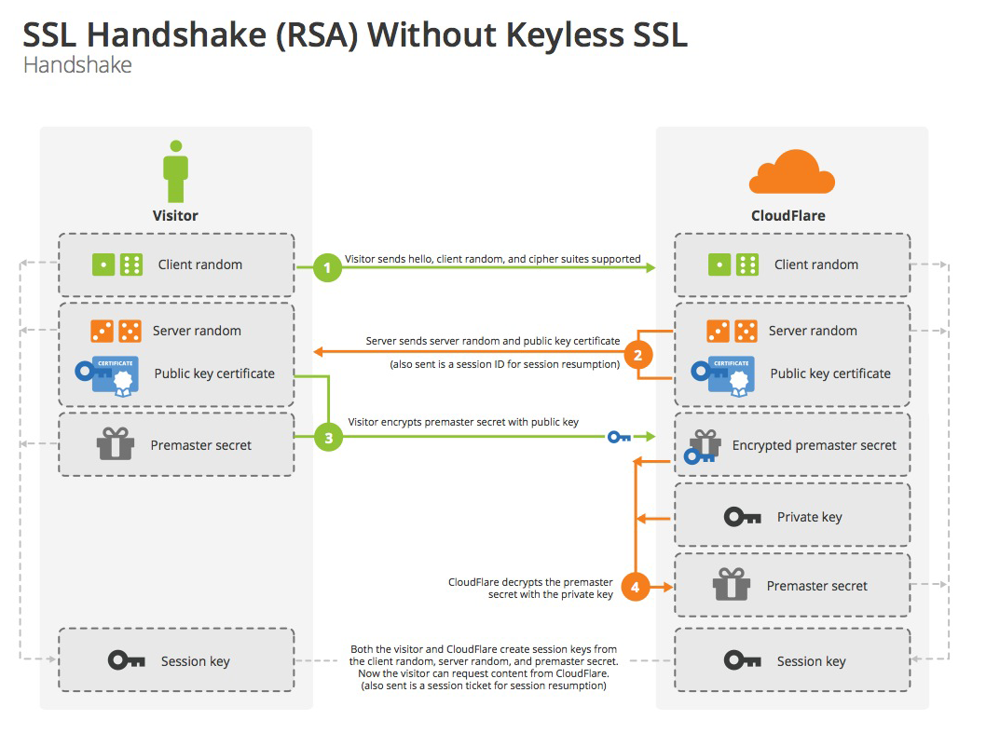

# 前言

在大部分的应用中，用得最多的应用层协议就是HTTP协议了，目前为止大部分的网站依然只支持HTTP访问。在HTTP协议中有可能存在信息窃听和或者身份伪装等安全问题。使用HTTPS通信机制可以有效地防止这些问题。

# HTTP缺点

HTTP具有相当优秀和方便的一面，事物皆具有两面性，它也有不足之处：

- 通信使用明文，内容可能会被窃听
- 不验证通信方的身份，因此有可能遭遇伪装
- 无法验证报文的完整性，所以有可能已经遭到篡改

这些问题不仅在HTTP上出现，其他未加密的协议中也会存在这类问题。

# SSL/TLS设计初衷

SSL/TLS协议是为了解决HTTP存在的风险而设计的，希望能达到：

- 所有信息都是加密传播，第三方无法窃听
- 具有校验机制，一旦被篡改，通信双方立刻发现
- 配备身份证书，防止身份被冒充

互联网是开放的环境，而且通信双方都是未知身份，这为协议的设计带来了很大的难度。而且，协议还必须能够经受所有匪夷所思和莫名其妙的攻击，者使得SSL/TLS协议变得异常复杂。

# SSL/TLS历史发展

互联网加密通信协议的历史，几乎与互联网一样长。

- 1994年，NetScape公司设计了SSL协议（Secure Sockets Layer）的1.0版，但是未发布。

- 1995年，NetScape公司发布SSL 2.0版，很快发现有严重漏洞。

- 1996年，SSL 3.0版问世，得到大规模应用。

- 1999年，互联网标准化组织ISOC接替NetScape公司，发布了SSL的升级版[TLS](http://en.wikipedia.org/wiki/Secure_Sockets_Layer) 1.0版。

- 2006年和2008年，TLS进行了两次升级，分别为TLS 1.1版和TLS 1.2版。最新的变动是2011年TLS 1.2的[修订版](http://tools.ietf.org/html/rfc6176)。

目前，应用最广泛的是TLS 1.0，接下来是SSL 3.0。但是，主流浏览器都已经实现了TLS 1.2的支持。

TLS 1.0通常被标示为SSL 3.1，TLS 1.1为SSL 3.2，TLS 1.2为SSL 3.3。

# 简单HTTP例子

Golang的标准库net/http提供了https server的基本实现，使用Go创建一个HTTP Server，几行代码就搞定了：

```go
package main

import (
    "fmt"
    "net/http"
)

func handler(w http.ResponseWriter, r *http.Request) {
    fmt.Fprintf(w, "Hi, this is an http service.")
}

func main() {
    http.HandleFunc("/", handler)
    http.ListenAndServe(":8080", nil)
}
```

运行程序，在浏览器访问：http://localhost:8080，你会看到Hi, this is an http service. 输出到浏览器窗口。

# 升级例子为HTTPS

我们稍微修改下HTTP的例子，就能将上面的HTTP Server升级为HTTPS Web Server：

```go
package main

import (
    "fmt"
    "net/http"
)

func handler(w http.ResponseWriter, r *http.Request) {
    fmt.Fprintf(w, "Hi, this is an https service.")
}

func main() {
    http.HandleFunc("/", handler)
    http.ListenAndServeTLS(":443", "server.crt", "server.key", nil)
}
```

对于上面的HTTP例子，我做了以下的调整：

- 用http.ListenAndServeTLS替换掉了http.ListenAndServe
- http的端口调整为443（这个我试了，如果用8080，会访问不了，暂时不知道为啥，我还要再看看）
- http.ListenAndServeTLS新增了两个参数certFile和keyFile，需要我们传入两个文件的路径
- 利用openssl生成server.crt和server.key文件，主要为了让整个程序跑通

server.crt和server.key文件生成流程：

```bash
root$ openssl genrsa -out server.key 2048
Generating RSA private key, 2048 bit long modulus
........................................................................................+++
................................................+++
e is 65537 (0x10001)

root$ openssl req -new -x509 -key server.key -out server.crt -days 365
You are about to be asked to enter information that will be incorporated
into your certificate request.
What you are about to enter is what is called a Distinguished Name or a DN.
There are quite a few fields but you can leave some blank
For some fields there will be a default value,
If you enter '.', the field will be left blank.
-----
Country Name (2 letter code) []:
State or Province Name (full name) []:
Locality Name (eg, city) []:
Organization Name (eg, company) []:
Organizational Unit Name (eg, section) []:
Common Name (eg, fully qualified host name) []:localhost
Email Address []:

```

> 在生成证书的时候，那个Common Name选项需要填写下，不然证书生成会异常。

同样，再次运行程序，在浏览器访问：http://localhost:443，你会看到Hi, this is an https service. 输出到浏览器窗口。

使用curl工具进行验证服务：

```bash
curl -v -k https://localhost:443
```

# 加密方式与数字证书

在实际的应用中，HTTPS采用对称与非对称的这两种加密方式，单纯使用其中一种都会存在一些问题：

- 对称加密：在通信双方使用一个密钥，该密钥既用于数据加密，也用于数据解密。缺点：密钥管理相对复杂
- 非对称加密：使用两个密钥，发送方使用公钥对数据进行加密，接收方使用私钥对数据进行解密。缺点：处理性能较低，资源占用高的问题

HTTPS服务端在连接建立过程中（握手协议）:

- 客户端给出协议的版本号，生成一个随机数（Client random），以及可以支持的加密方法
- 服务端确认双方使用的加密方法，并且将数字证书以及生成一个随机数（Server random）发送给客户端
- 客户端校验数字证书是否有效，验证成功后，生成一个随机数（Premaster secret），通过公钥加密后发送给服务端
- 服务端使用私钥获取客户端发送过来的随机数。这个协商过程则是基于非对称加密的，因为这个时候客户端已经拿到了公钥，而服务端有私钥
- 接下来双方的通讯，就使用约定的加密方法，使用前面三个随机数，生成“对话密钥”，用来加密接下来的整个对话过程。后面的过程就是使用对称加密算法了

上面的过程，就如下图所示：



> 在双方握手过程中，如何保障HTTPS服务端发送给客户端的公钥信息没有被篡改？

实际上，HTTPS并非直接传输公钥信息，而是使用携带公钥信息的数字证书来保证公钥的安全性和完整性。


**接下来我们来了解下数字证书：**

可以认为是互联网上的”身份证“，用于唯一标识一个组织或一个服务器的，就好比我们的居民身份证，用于标识一个人。服务端将数字证书传输给客户端，客户端如何校验这个证书的真伪呢？我们知道居民身份证是由国家统一制作和颁发，个人向户口所在地公安机关申请，国家颁发的身份证才具有法律效力。任何地方这个身份证都是有效和可被接纳的。

网站的证书也是同样的道理，一般来说数字证书从受信的权威机构买来的。一般浏览器在出厂时就内置了诸多知名CA（e.g. Verisign、GoDaddy、美国国防部、CNNIC等）的数字证书校验方法，只要是这些CA机构颁发的证书，浏览器都是校验。对于未知CA的证书，浏览器则会报错。主流浏览器都有证书管理功能，但鉴于这些功能比较高级，一般用户是不用去关心的。


# 参考资料

《图解HTTP》

SSL/TLS协议运行机制的概述 http://www.ruanyifeng.com/blog/2014/02/ssl_tls.html

图解SSL/TLS协议 http://www.ruanyifeng.com/blog/2014/09/illustration-ssl.html

