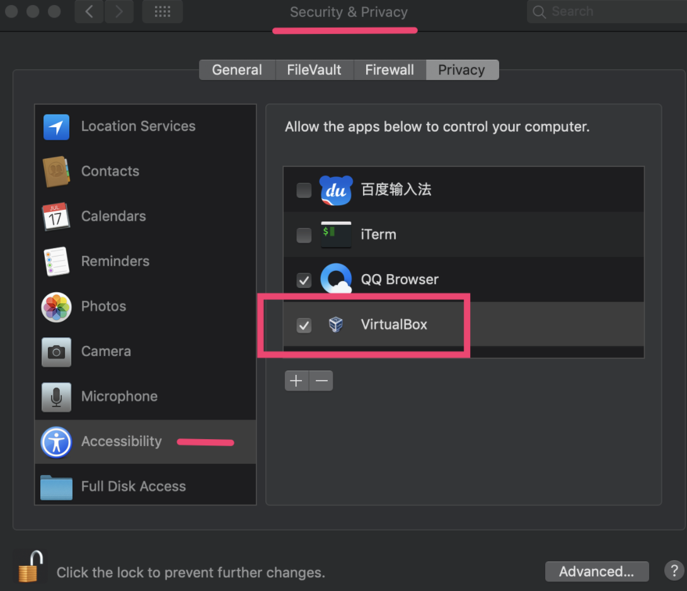
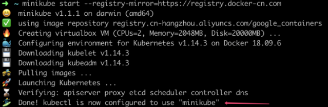
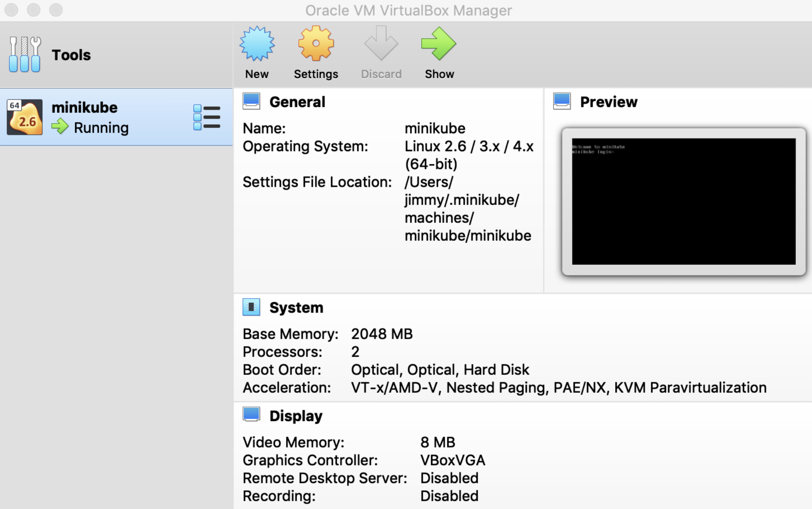
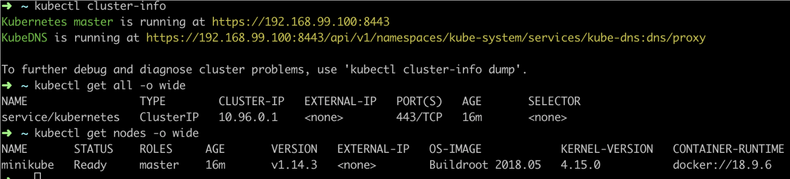
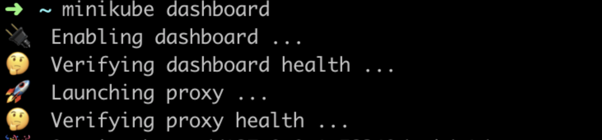
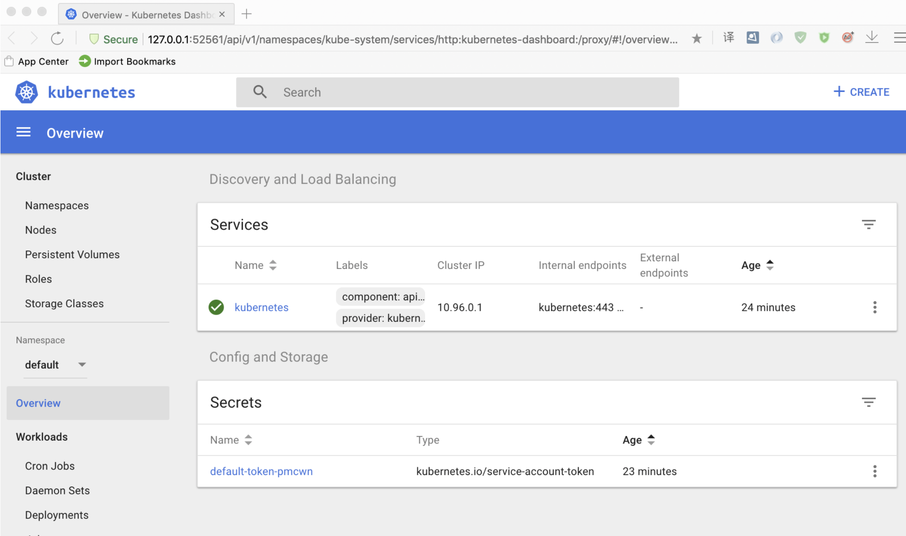
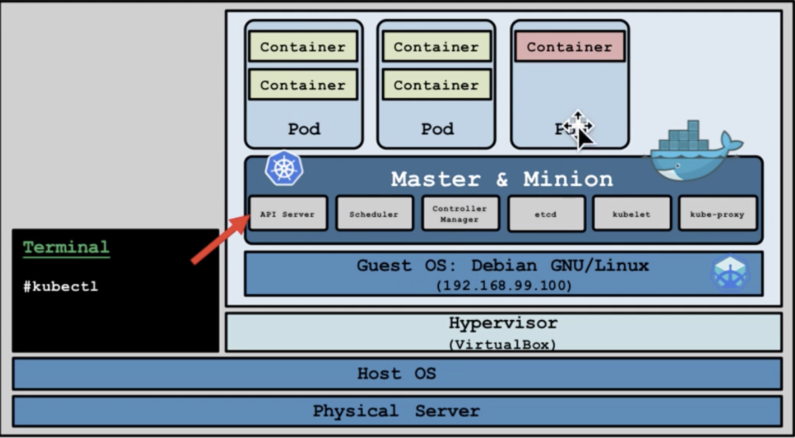
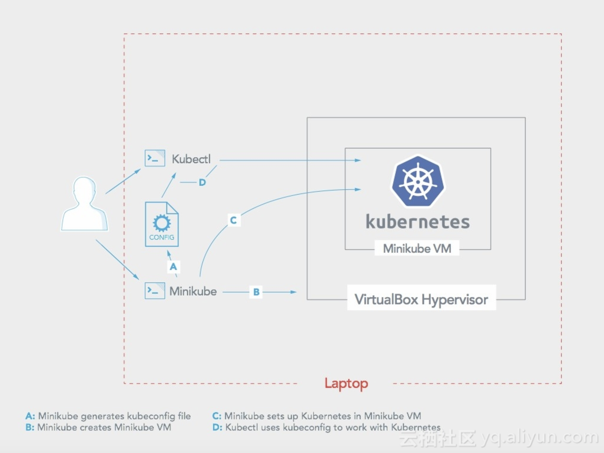

# 环境准备

环境： mac os(Mojave)

前提：先安装好kubectl (brew install kubectl) 、[docker desktop](https://www.docker.com/products/docker-desktop)(建议最新版本)

步骤:

# 安装VirtualBox

下载地址： https://www.virtualbox.org/ （目前最新版本: 6.0）

一路next就好，要注意的是：安装过程中，可能会弹出一个系统安全相关的对话框，一定要允许，并在Security&Privacy这里，把VirtualBox勾上



否则，折腾到最后，会发现minikube虚拟机无法启动。

 

# 安装阿里云版的minikube

官方出品的minikube，默认连接的是google官方站点，由于众所周知的原因，天朝屁民无缘访问。所以必须用阿里版的minikube（感谢阿里）

```
curl -Lo minikube http://kubernetes.oss-cn-hangzhou.aliyuncs.com/minikube/releases/v1.1.1/minikube-darwin-amd64 && chmod +x minikube && sudo mv minikube /usr/local/bin/
```

执行这一串后，就把minikube安装好了。　

 

# 创建minikube集群

```
minikube start --registry-mirror=https://registry.docker-cn.com
```

注：如果首次失败了(比如：步骤一中的安全设置没勾选，导致无法启用），可以先尝试minikute delete 删除原来的machine。



如果顺便的话，先看到类似上面的输出（前面的icon花花绿绿，还蛮好看的）

同时，如果virtualbox开着，也能看到创建了一个名为minikube的虚拟机：



 

# kubectl测试

terminal中可以输入下列命令，查看集群信息： 

kubectl cluster-info

kubectl get nodes -o wide



 

# dashboard

terminal中输入 minikube dashboard



正常的话，会弹出浏览器，看到以下界面：



 

minikube架构与常规k8s架构的区别：

下图是常规k8s的集群架构，master通常是单独的，用于协调调试其它节点 

环境/image-20200622093223449.png)

下图是minikube的架构，master节点与其它节点，合为一体（为了节省资源）



具体处理过程，可以参考下图中的A-B-C-D四个过程。



# 参考文章

https://zhuanlan.zhihu.com/p/53260098

https://yq.aliyun.com/articles/221687

https://kubernetes.io/zh/docs/tutorials/kubernetes-basics/

https://www.youtube.com/watch?v=Q6g7w7Cmwlk