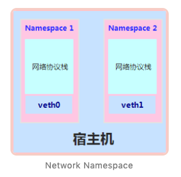
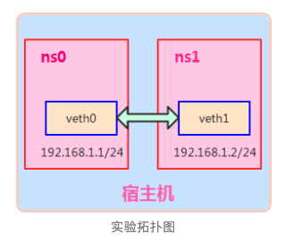
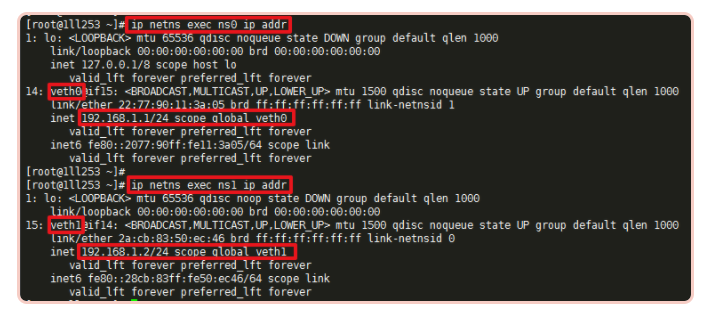
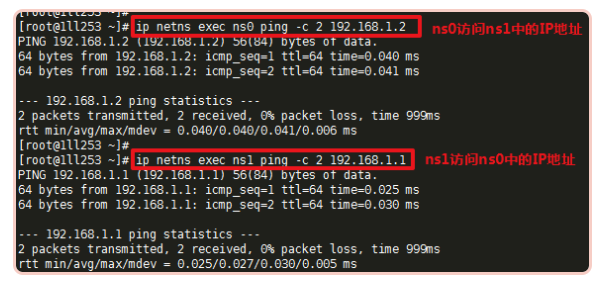
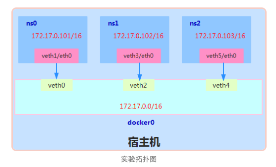
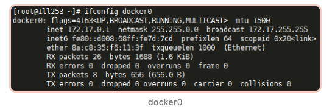
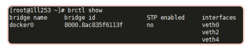

## 背景

在Linux虚拟化技术中，网络层面，通常重要的三个技术分别是`Network Namespace`、`veth pair`、以及`网桥`或虚拟交换机技术。今天就通过实验带大家一起学习下Linux网络虚拟化技术。

我们首先了解下`Network Namespace`，它是由Linux内核提供，是实现网络虚拟化的重要功能。通过创建多个隔离的网络空间，实现网络资源的隔离。

不同的Network Namespace的资源互相不可见，彼此之间无法通信。如下图所示：



## ip netns命令

Network Namespace是Linux内核提供的功能，本文借助ip命令来完成各种操作。ip命令来自于`iproute2`安装包，一般系统默认安装，如果没有的话，读者可自行安装。

ip命令管理的功能很多，和Network Namespace有关的操作都在其子命令`ip netns`下进行的，可以通过`ip netns help`查询命令帮助信息

```
[root@qll253 ~]# ip netns help
Usage: ip netns list
       ip netns add NAME
       ip netns set NAME NETNSID
       ip [-all] netns delete [NAME]
       ip netns identify [PID]
       ip netns pids NAME
       ip [-all] netns exec [NAME] cmd ...
       ip netns monitor
       ip netns list-id
```

## 创建Network Namespace

##### 1、通过 ip netns add 命令创建一个名为`ns0`的网络命名空间：

```
[root@1ll253 ~]# ip netns add ns0
```

##### 2、查询命名空间

```
[root@1ll253 ~]# ip netns list
ns0
```

##### 3、命名空间所在目录

```
[root@1ll253 ~]# ls /var/run/netns/
ns0
```

> **注意**：新创建的 Network Namespace 会出现在/var/run/netns/目录下。如果需要管理其他不是 ip netns 创建的 network namespace，只要在这个目录下创建一个指向对应 network namespace 文件的链接即可。

## 操作Network Namespace

对于每个 Network Namespace 来说，它会有自己独立的网卡、路由表、ARP 表、iptables 等和网络相关的资源。ip命令提供了`ip netns exec`子命令可以在对应的 Network Namespace 中执行命令。

##### 1、查看网络命名空间 ns0 的网卡信息

```
[root@1ll253 ~]# ip netns exec ns0 ip addr
1: lo: <LOOPBACK> mtu 65536 qdisc noop state DOWN group default qlen 1000
    link/loopback 00:00:00:00:00:00 brd 00:00:00:00:00:00
```

每个 namespace 在创建时会自动创建一个回环接口`lo`，默认不启用。它的作用和Linux系统中默认看到的lo一样，都是为了实现loopback通信，如果希望lo口能工作，可以通过下面的步骤2启用它。

##### 2、启用lo回环网卡：

```
[root@1ll253 ~]# ip netns exec ns0 ip link set lo up
```

再次检查回环网卡状态：

```
[root@1ll253 ~]# ip netns exec ns0 ip addr
1: lo: <LOOPBACK,UP,LOWER_UP> mtu 65536 qdisc noqueue state UNKNOWN group default qlen 1000
    link/loopback 00:00:00:00:00:00 brd 00:00:00:00:00:00
    inet 127.0.0.1/8 scope host lo
       valid_lft forever preferred_lft forever
    inet6 ::1/128 scope host 
       valid_lft forever preferred_lft forever
```

会发现此时回环口卡处于`UP`状态，并且系统分配`127.0.0.1/8`的ip地址。

##### 3、在 ns0 中打开一个shell终端

```
[root@1ll253 ~]# ip netns exec ns0 /bin/bash
[root@1ll253 ~]# ip addr
1: lo: <LOOPBACK,UP,LOWER_UP> mtu 65536 qdisc noqueue state UNKNOWN group default qlen 1000
    link/loopback 00:00:00:00:00:00 brd 00:00:00:00:00:00
    inet 127.0.0.1/8 scope host lo
       valid_lft forever preferred_lft forever
[root@1ll253 ~]# exit
exit
```

通过执行`ip netns exec ns0 /bin/bash`进入ns0的shell终端，后面所有的命令都在这个Network Namespace中执行，好处是不用每次执行命令时都要带上ip netns exec ，**缺点是我们无法清楚知道自己当前所在的shell，容易混淆。**

**可以采用下面的方法解决：**

```
[root@1ll253 ~]# ip netns exec ns0 /bin/bash --rcfile <(echo "PS1=\"ns0> \"")
ns0> 
```

## Network Namespace 之间的通信

默认情况下，network namespace 是不能和主机网络，或者其他 network namespace 通信的。

可以使用 Linux 提供的`veth pair`来完成通信，veth pair你可以理解为使用网线连接好的两个接口，把两个端口放到两个namespace中，那么这两个namespace就能打通。

接下来我们通过实验进行验证：



##### 1、创建veth pair

```
[root@1ll253 ~]# ip link add type veth
[root@1ll253 ~]# ip link
14: veth0@veth1: <BROADCAST,MULTICAST,M-DOWN> mtu 1500 qdisc noop state DOWN mode DEFAULT group default qlen 1000
    link/ether 06:17:62:85:64:fc brd ff:ff:ff:ff:ff:ff
15: veth1@veth0: <BROADCAST,MULTICAST,M-DOWN> mtu 1500 qdisc noop state DOWN mode DEFAULT group default qlen 1000
    link/ether fe:9a:48:e4:a3:99 brd ff:ff:ff:ff:ff:ff
[root@1ll253 ~]# 
```

可以看到，此时系统中新增了一对veth pair：veth0和veth1，需要记住的是veth pair无法单独存在，删除其中一个，另一个也会自动消失。

**如果需要指定veth pair两个端点的名称，可以使用下面的命令：**

```
[root@1ll253 ~]# ip link add veth001 type veth peer name veth002
[root@1ll253 ~]# ip link
12: veth002@veth001: <BROADCAST,MULTICAST,M-DOWN> mtu 1500 qdisc noop state DOWN mode DEFAULT group default qlen 1000
    link/ether aa:3e:04:da:a7:69 brd ff:ff:ff:ff:ff:ff
13: veth001@veth002: <BROADCAST,MULTICAST,M-DOWN> mtu 1500 qdisc noop state DOWN mode DEFAULT group default qlen 1000
    link/ether 3e:5d:5f:4e:06:2b brd ff:ff:ff:ff:ff:ff
```

##### 2、创建Network Namespace

我们已创建了一个名为`ns0`的Network Namespace，下面再创建一个名称为`ns1`的网络命名空间。

```
[root@1ll253 ~]# ip netns add ns1
[root@1ll253 ~]# ip netns list
ns1
ns0
```

##### 3、把veth pair分别加入到这两个namespace中

将veth0加入到ns0，将veth1加入到ns1，如下所示：

```
[root@1ll253 ~]# ip link set veth0 netns ns0
[root@1ll253 ~]# ip link set veth1 netns ns1
```

##### 4、分别为这对veth pair配置上ip地址，并启用

1）为veth0配置IP，并启用该虚拟网卡

```
[root@1ll253 ~]# ip netns exec ns0 ip addr add 192.168.1.1/24 dev veth0
[root@1ll253 ~]# ip netns exec ns0 ip link set veth0 up
```

2）为veth1配置IP，并启用该虚拟网卡

```
[root@1ll253 ~]# ip netns exec ns1 ip addr add 192.168.1.2/24 dev veth1
[root@1ll253 ~]# ip netns exec ns1 ip link set veth1 up
```

##### 5、查看这对veth pair的状态



###### 6、验证两个Network Namespace之间的互通



可以看到，veth pair成功实现了两个不同Network Namespace之间的网络交互。

## 网桥

虽然veth pair可以实现两个 Network Namespace 之间的通信，但 veth pair 有一个明显的缺陷，就是只能实现两个网络接口之间的通信。如果多个network namespace需要进行通信，则需要借助`bridge`。

下面我们通过实验来进行讲解：



##### 0、还原网络环境

为方便接下来的实验，我们把刚刚创建的Network Namespace及veth pair删除，保证纯净的网络环境。

```
[root@1ll253 ~]# ip netns delete ns0
[root@1ll253 ~]# ip netns delete ns1
```

##### 1、创建3个Network Namespace

```
[root@1ll253 ~]# ip netns add ns0
[root@1ll253 ~]# ip netns add ns1
[root@1ll253 ~]# ip netns add ns2
```

##### 2、创建3对veth pair

```
[root@1ll253 ~]# ip link add type veth
[root@1ll253 ~]# ip link
16: veth0@veth1: <BROADCAST,MULTICAST,M-DOWN> mtu 1500 qdisc noop state DOWN mode DEFAULT group default qlen 1000
    link/ether ba:fa:d6:14:e1:32 brd ff:ff:ff:ff:ff:ff
17: veth1@veth0: <BROADCAST,MULTICAST,M-DOWN> mtu 1500 qdisc noop state DOWN mode DEFAULT group default qlen 1000
    link/ether a2:ef:d9:a5:96:51 brd ff:ff:ff:ff:ff:ff
18: veth2@veth3: <BROADCAST,MULTICAST,M-DOWN> mtu 1500 qdisc noop state DOWN mode DEFAULT group default qlen 1000
    link/ether a2:5b:e7:9e:b1:55 brd ff:ff:ff:ff:ff:ff
19: veth3@veth2: <BROADCAST,MULTICAST,M-DOWN> mtu 1500 qdisc noop state DOWN mode DEFAULT group default qlen 1000
    link/ether 92:91:67:ab:69:ac brd ff:ff:ff:ff:ff:ff
20: veth4@veth5: <BROADCAST,MULTICAST,M-DOWN> mtu 1500 qdisc noop state DOWN mode DEFAULT group default qlen 1000
    link/ether 8a:c8:35:f6:11:3f brd ff:ff:ff:ff:ff:ff
21: veth5@veth4: <BROADCAST,MULTICAST,M-DOWN> mtu 1500 qdisc noop state DOWN mode DEFAULT group default qlen 1000
    link/ether 2a:b7:82:d4:49:d5 brd ff:ff:ff:ff:ff:ff
```

##### 3、创建网桥

```
// 创建名为 docker0 的网桥
[root@1ll253 ~]# ip link add docker0 type bridge

//启动 docker0 网桥
[root@1ll253 ~]# ip link set dev docker0 up

//为docker0网桥配置IP
[root@1ll253 ~]# ifconfig docker0 172.17.0.1/16
```

此时可以通过ifconfig命令查看：



##### 4、绑定网口

Network Namespace、veth pair、bridge 都创建完毕，**下面通过命令将每对veth pair的一端绑定在network namespace，另一端绑定在****`docker0`网桥上，用于实现网络互通**

1）配置第一个网络命名空间 ns0

```
// 将veth1添加进ns0
[root@1ll253 ~]# ip link set dev veth1 netns ns0

//将veth1重命名为eth0
[root@1ll253 ~]# ip netns exec ns0 ip link set dev veth1 name eth0

//为ns0中的eth0配置ip
[root@1ll253 ~]# ip netns exec ns0 ip addr add 172.17.0.101/16 dev eth0

// 启动ns0中的eth0网卡
[root@1ll253 ~]# ip netns exec ns0 ip link set dev eth0 up

// 将veth0添加加网桥docker0
[root@1ll253 ~]# ip link set dev veth0 master docker0

// 启动veth0网卡
[root@1ll253 ~]# ip link set dev veth0 up
```

2）配置第二个网络命名空间 ns1

```
[root@1ll253 ~]# ip link set dev veth3 netns ns1
[root@1ll253 ~]# ip netns exec ns1 ip link set dev veth3 name eth0
[root@1ll253 ~]# ip netns exec ns1 ip addr add 172.17.0.102/16 dev eth0
[root@1ll253 ~]# ip netns exec ns1 ip link set dev eth0 up
[root@1ll253 ~]# ip link set dev veth1 master docker0
[root@1ll253 ~]# ip link set dev veth3 up
```

2）配置第三个网络命名空间 ns2

```
[root@1ll253 ~]# ip link set dev veth5 netns ns2
[root@1ll253 ~]# ip netns exec ns2 ip link set dev veth5 name eth0
[root@1ll253 ~]# ip netns exec ns2 ip addr add 172.17.0.103/16 dev eth0
[root@1ll253 ~]# ip netns exec ns1 ip link set dev eth0 up
[root@1ll253 ~]# ip link set dev veth5 master docker0
[root@1ll253 ~]# ip link set dev veth5 up  
```

##### 5、查看绑定端口



> 和网桥有关的操作还可以使用`brctl`，这个命令来自 bridge-utils安装包。这里使用`brctl show`来查询网桥docker0下绑定的网卡。

##### 6、验证多个namespace之间的通信

```
// 进入ns0 bash终端
[root@1ll253 ~]# ip netns exec ns0 /bin/bash --rcfile <(echo "PS1=\"ns0> \"")

// ping 网桥docker0
ns0> ping -c 1 172.17.0.1
PING 172.17.0.1 (172.17.0.1) 56(84) bytes of data.
64 bytes from 172.17.0.1: icmp_seq=1 ttl=64 time=0.033 ms
...

// ping ns1上的eth0网卡
ns0> ping -c 1 172.17.0.102
PING 172.17.0.102 (172.17.0.102) 56(84) bytes of data.
64 bytes from 172.17.0.102: icmp_seq=1 ttl=64 time=0.049 ms
...

// ping ns2上的eth0网卡
ns0> ping -c 1 172.17.0.103
PING 172.17.0.103 (172.17.0.103) 56(84) bytes of data.
64 bytes from 172.17.0.103: icmp_seq=1 ttl=64 time=0.038 ms
```


资料来源

https://mp.weixin.qq.com/s/BFNtcZ_6tnHkeAPe68FM0g