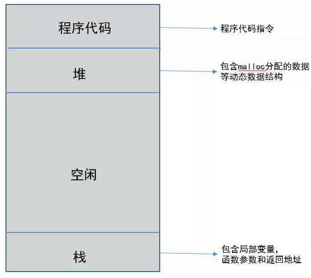

# 进程

操作系统提供的抽象概念，是系统资源分配与调度的基本单元，是操作系统结构的基础。

程序是指令、数据与组织形式的描述，进程是程序的实体。程序本身没有生命周期的，是存储在磁盘上的一些指令，程序运行起来就是进程。

当程序需要运行时，操作系统需要以下步骤：

1. 将代码和所有静态数据记载到内存和进程的地址空间（每个进程拥有唯一的地址空间）
2. 创建和初始化栈（局部变量、函数参数和返回地址）
3. 分配堆内存以及IO相关任务
4. 启动程序，OS将CPU控制权转移到新创建的进程
5. 进程开始运行

一个进程至少5种基本状态：初始态，执行状态，等待（阻塞）状态，就绪状态，终止状态：

- 初始态：进程刚被创建，由于其他进程占用了CPU资源得不到执行，只能处于初始状态
- 执行状态：任意时刻处于执行状态的进程只能一个
- 就绪状态：只有处于就绪状态的经过调度才能到执行状态
- 等待状态：进程等待某件事件完成
- 停止状态：进程结束

## 进程和线程在多核cpu，多cpu中的运行关系

操作系统会拆分CPU为一段段时间的运行片，轮流分配给不同的程序。对于多cpu，多个进程可以并行在多个cpu中计算，当然也会存在进程切换；对于单cpu，多个进程在这个单cpu中是并发运行，根据时间片读取上下文+执行程序+保存上下文。同一个进程同一时间段只能在一个cpu中运行，如果进程数小于cpu数，那么未使用的cpu将会空闲。

多线程的概念主要有两种：一种是用户态多线程；一种是内核态多线程，对于内核态多线程（java1.2之后用内核级线程），在操作系统内核的支持下可以在多核下并行运行；
对于多核cpu，进程中的多线程并行执行。对于单核cpu，多线程在单cpu中并发执行，根据时间片切换线程。同一个线程同一时间段只能在一个cpu内核中运行，如果线程数小于cpu内核数，那么将有多余的内核空闲。

参考资料

https://mp.weixin.qq.com/s/BzJw4S3O7lZikTyhGa4P9A