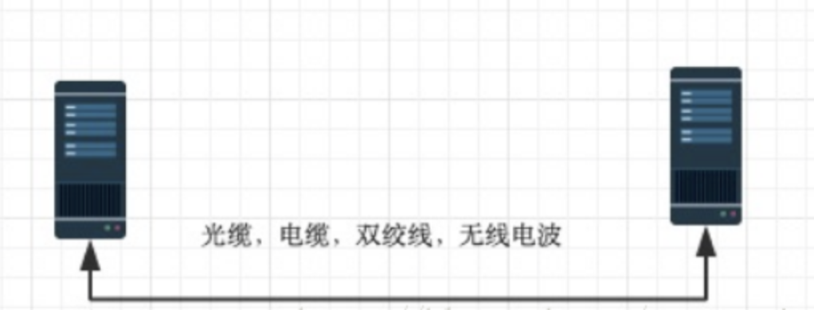

# 前言

互联网的本质是一系列的网络协议。这个协议就叫做OSI协议，按照功能和分工不同，人为的分为七层。实际上这七层是不存在的，只是人为的区分，让你明白每一层的作用。

实际上还有人把它划分为五层，四层。

七层划分为：应用层、表示层、会话层、传输层、网络层、数据链路层、物理层。

五层划分为：应用层、传输层、网络层、数据链路层、物理层。

四层划分为：应用层、传输层、网络层、网络接口层。

# 物理层

字面意思：物理传输、硬件、物理特性。

计算机与计算机之间的通信，需要有物理设备，需要底层通讯设备的连通。中间的物理连接，可以是光缆、电缆、双绞线、无线电波，中间传输的是010101...这些二进制位数据。

底层传输的010010101001...这些二级制位怎么才能让它有意义呢？

人为的分组再合适不过了，8为一组，发送和接收按照8位一组来划分。接收到8位为一组的话，就可以按照8位进行运算。如果没有分组，接收端计算机就不知道从哪一位开始计算，就无法开始解析数据。

那分组的工作是谁做的呢？是数据链路层来完成。

# 数据链路层

早期的时候，数据链路层就是对电信号进行分组。每个公司都有自己的分组方式，非常的乱，后来形成了统一的标准，以太网协议Ethernet。

## 以太网协议Ethernet

一组电信信号称之为数据包，也叫做帧。

没一数据帧分为head和data两部分：

`head | data`

- Head：固定18个字节
  - 发送者（源地址）：6个字节
  - 接收者（目标地址）：6个字节
  - 数据类型：6个字节
- Data：最短46个字节，最长1500个字节 

> 源地址和目标地址指的是**mac地址**

Head+Data：最短46个字节，最长1518字节，超过最大限制就分片发送

## Mac地址的由来

Ethernet规定接入Internet的设备都必须具备网卡。发送端和接收端的地址便是网卡地址，即Mac地址。

每张网卡在出厂时都被烧录一个MAC地址。

# 参考资料

https://blog.csdn.net/taotongning/article/details/81352985