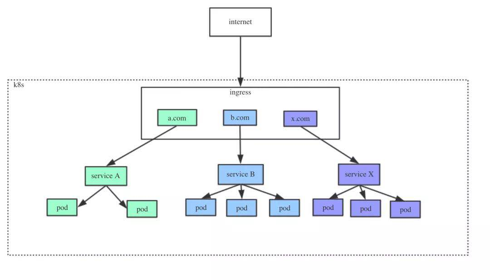

# 1. **前言**

对于Ingress，要先明白Service、Ingress与Ingress Controller的作用与关系，通俗的讲：

- **Service** 是后端真实服务的抽象，一个 Service 可以代表多个相同的后端服务
- **Ingress** 是反向代理规则，用来规定 HTTP/S 请求应该被转发到哪个 Service 上，比如根据请求中不同的 Host 和 url 路径让请求落到不同的 Service 上
- **Ingress Controller** 就是一个反向代理程序，它负责解析 Ingress 的反向代理规则，如果 Ingress 有增删改的变动，所有的 Ingress Controller 都会及时更新自己相应的转发规则，当 Ingress Controller 收到请求后就会根据这些规则将请求转发到对应的 Service。

# 2. **Ingress在gRPC服务中的使用**

实际上，ingress相当于一个7层的负载均衡器，是k8s对反向代理的一个抽象。根据虚拟的url或主机名来接收请求，经过处理后再转向相应的后端服务上。

使用Ingress作为K8S处理边缘入口流量的一种方式。使用如下图所示：



# **3. Ingress 转发流程**

由于 Kubernetes 集群内的服务都是虚拟网络，外部流量访问集群内部，至少需要一个公网ip和端口映射。

Kubernetes 有多种暴露边缘接口的方式，比如，nodeport、loadBalancer、ingress 等方式，相比而言，ingress 通过暴露有限的公网 ip，使用反向代理的方式，对于gRPC服务的部署相对是一种更加经济的方式。

## 请求转发流程

Ingress 是一种转发规则的抽象，Ingress Controller 的实现需要根据这些 Ingress 规则来将gRPC请求转发到对应的 Service。

通过下面的流程方便大家理解：


转发流程分析：

1. Ingress Controller 收到gRPC-client的gRPC请求
2. 匹配 Ingress 转发规则
3. 匹配到了就转发到后端 Service，
4. Service 正常代表的后端 Pod 有多个，选出一个转发到那个 Pod，最终由那个 Pod 处理请求。

## service如何进行服务发现 

具体服务发现流程，如下所示：


流程分析：

1. service可以将pod ip封装起来，即使pod发生重建，依然可以通过service来访问pod提供的服务，
2. service还解决了负载均衡的问题，运行在每个node上的kube-proxy进程其实就是一个智能的软件负载均衡器，他负责把service的请求转发到后端的某个pod实例。
3. kube-dns可以解决Service的发现问题，k8s将Service的名称当做域名注册到kube-dns中，通过Service的名称就可以访问其提供的服务

# **4. 实际部署例子**

## 部署信息

编写简单gRPC服务例子，来验证我们的方案。以下为两个项目部署信息：

1. grpc-server-demo项目。gRPC服务接口的实现，便于观察负载均衡情况：
   - 域名：[http://grpc-server-demo.example.com](http://grpc-client-demo.hlgdata.com/)
   - 部署实例：2个
2. grpc-client-demo项目。gRPC客户端调用服务实现：
   - 域名：http://[grpc-server-demo.example.com](http://grpc-server-demo.hlgdata.com/)
   - 部署实例：1个

## 服务发现与负载均衡测试

为了测试服务端的负载均衡情况，编写脚本模拟用户请求，串行发起100次请求，发起请求测试代码，如下所示

```sh
#!/bin/bash
  
startTs=$(date +%s)
for ((i=1; i<100; i++)); do
    name="hello_grpc_test_$i"
    curl http://${domainName}?name=$name >/dev/null 2>&1
    # echo "progress: $i, ret: $?"
done
endTs=$(date +%s)
let cost=$endTs-$startTs
echo "startTs: $startTs"
echo "endTs: $endTs"
echo "cost: $cost"
```


请求之后，在Server端两个pod分别查看日志，可以看到2个pod，接收到不同的请求，可以看到pod直接做了负载。


结论：当客户端连续多次请求的时，服务端在k8s内，能够实现负载均衡。

备注：以上部署例子，只是单纯的服务调用，未模拟真实的业务场景。