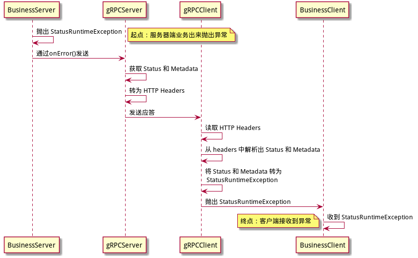

# 1. 前言

## 1.1 介绍

gRPC Spring Boot Starter 项目是一个 gRPC 的 Spring Boot 模块。通过在 Spring Boot 中内嵌一个 gRPC Server 对外提供服务，并支持 Spring Cloud 的服务发现、注册、链路跟踪等等。

## 1.2 特性

- 在 spring boot 应用中，通过 @GrpcService 自动配置并运行一个嵌入式的 gRPC 服务。
- 使用 @GdGrpcClient 自动创建和管理您的 gRPC Channels 和 stubs
- 支持全局和自定义的 gRPC 服务端/客户端拦截器

# 2. 快速入门

## 模块角色说明

| 模块       | 角色           | 说明                                                         |
| :--------- | :------------- | :----------------------------------------------------------- |
| client     | 客户端         | 依赖interfaces库，使用任何预生成的stub来访问服务器的客户端项目 (无感知目标服务器调用) |
| server     | 服务提供者     | 依赖interfaces库，并提供对应protobuf中对应的方法实现 (实现后即可被任何客户端调用) |
| interfaces | 接口定义公共库 | 简单来说，就是protobuf文件的module，不同的项目中会共享这个部分 |

友情提示：根据上面模块名，进入对应链接，可以查看到对应的demo。

## 模块交互流程图


# 3. 异常处理流程

## **异常处理流程图**

如下所示



## 服务器处理方式

\> 无特殊情况都应继承 GaoDingGreeterGrpc (lib打包时自动生成)，可预支异常请抛出 ServiceException的子类

**服务器处理**

```java
@Slf4j
@GrpcService
public class GreeterService extends GdGrpcGreeter {
 
    @Override
    public HelloReply sayHello(HelloRequest request) {
        // (无用户信息异常，code：-98)
        if ("error".equals(request.getName())) {
            throw new NoUserException();
        }
        // 异常场景二
        if ("timeout".equals(request.getName())) {
            String errMsg = "request timeout, please try again";
            throw new ValidateException(errMsg);
        }
        // 成功的情况
        return HelloReply.newBuilder()
                .setMessage("hello")
                .build();
    }
}
```

## 客户端处理方式

普通模式，不进行捕捉（适合A→B服务，B服务错误时A也错误的情况）

**普通模式**

```java
public String sayHello(final String name) {
    GreeterOuterClass.HelloReply response = this.greeterStub.sayHello(GreeterOuterClass.HelloRequest.newBuilder().setName(name).build());
    String message = response.getMessage();
    return message;
}
```

通过try-catch模式，处理服务端返回的StatusRuntimeException信息，来判断服务端的的异常CODE以及异常信息。

```java
try {
    GreeterOuterClass.HelloReply response = this.greeterStub.greeteTo(GreeterOuterClass.HelloRequest.newBuilder().setName(name).build());
    return response.getMessage();
} catch (StatusRuntimeException e) {
    GrpcExceptionResult result = GdGrpcUtil.parse(e);
    log.error("code => {} msg =>  {}", result.getCode(), result.getMessage());
    throw e;
}
```


# **4. 拦截器 Interceptor**

grpc提供了interceptor功能，可以在服务端接收到请求时优先对请求中的数据做一些处理后再转交给指定的服务处理并响应，很适合在这里处理验证、日志等流程。

## 4.1 ClientInterceptor

作用在传输channel和本地存根stub之间，用于：

- 向标头元数据添加凭据
- 记录和监控呼叫行为
- 请求和响应重写


定义统一的请求携带Token信息拦截器

```java
@Slf4j
public class TokenGrpcInterceptor implements ClientInterceptor {
 
    private static final Metadata.Key<String> TOKEN_METADATA_KEY = Metadata.Key.of("token", ASCII_STRING_MARSHALLER);
 
    @Override
    public <ReqT, RespT> ClientCall<ReqT, RespT> interceptCall(MethodDescriptor<ReqT, RespT> method, CallOptions callOptions, Channel next) {
        return new SimpleForwardingClientCall<ReqT, RespT>(next.newCall(method, callOptions)) {
            @Override
            public void start(Listener<RespT> responseListener, Metadata headers) {
                // 设置token的值
                String token = String.valueOf(System.currentTimeMillis());
                headers.put(TOKEN_METADATA_KEY, token);
                log.info("token: " + token);
 
                super.start(new SimpleForwardingClientCallListener<RespT>(responseListener) {
                    @Override
                    public void onHeaders(Metadata headers) {
                        log.info("header received from server:" + headers);
                        super.onHeaders(headers);
                    }
                }, headers);
            }
        };
    }
}
```


自动装配

添加全局的拦截器

```java
@Order(Ordered.LOWEST_PRECEDENCE)
@Configuration
public class GlobalClientInterceptorConfiguration {
 
    @Bean
    public GlobalClientInterceptorConfigurer globalInterceptorConfigurerAdapter() {
        return re -> re.addClientInterceptors(new TokenGrpcInterceptor());
    }
}
```

## 4.2 ServerInterceptor

作用在client过来的请求被ServerCallHandler分发之前，用于：

- 统一的请求日志记录
- 执行有效的身份验证凭据
- 记录和监控行为

```
定义统一的Token信息拦截类TokenGrpcInterceptor
```

使用ServerInterceptor，然后通过传播身份Context，这使你可以获取统一参数的策略。

拦截器可以从中检索Metadata headers。然后获取token信息，通过Context传达给服务实现方法。

全局参数传播：该方法可以用于全局的user_id,trace_id,orgId等参数的传播。

不同组件可以约定，根据全局参数进行透传参数。

```java
@Slf4j
public class TokenGrpcInterceptor implements ServerInterceptor {
 
    private static final Metadata.Key<String> TOKEN_METADATA_KEY = Metadata.Key.of("token", ASCII_STRING_MARSHALLER);
 
    public static final Context.Key<String> TOKEN_CTX_KEY = Context.key("token");
 
    @Override
    public <ReqT, RespT> ServerCall.Listener<ReqT> interceptCall(ServerCall<ReqT, RespT> serverCall, Metadata metadata, ServerCallHandler<ReqT, RespT> serverCallHandler) {
        // 从META中获取参数配置
        String token = metadata.get(TOKEN_METADATA_KEY);
        Context ctx = Context.current().withValue(TOKEN_CTX_KEY, token);
        log.info("intercept call token: " + token);
        return Contexts.interceptCall(ctx, serverCall, metadata, serverCallHandler);
    }
}
```


自动装配

添加全局的拦截器

```java
@Configuration
public class GlobalInterceptorConfiguration {
 
    @Bean
    public GlobalServerInterceptorConfigurer globalCustomInterceptorConfigurerAdapter() {
        return new GlobalServerInterceptorConfigurer() {
            @Override
            public void addServerInterceptors(GlobalServerInterceptorRegistry globalServerInterceptorRegistry) {
                globalServerInterceptorRegistry.addServerInterceptors(new TokenGrpcInterceptor());
            }
        };
    }
}
```

**
**

在服务提供方法中，获取拦截到的信息

```java
@GrpcService
public class GreeterService extends GreeterGrpc.GreeterImplBase {
 
    @Override
    public void greeteTo(HelloRequest request, StreamObserver<HelloReply> responseObserver) {
        // 获取拦截到的参数信息
        String token = TokenGrpcInterceptor.TOKEN_CTX_KEY.get();
        log.info("current context greeteTo token: " + token);
    }
}
```


# **5. 单元测试**

以下场景，主要针对服务端的接口进行测试。

## 5.1 独立测试

独立测试对外部库没有任何依赖关系。

```java
@Slf4j
public class GreeterServiceTest {
 
    private GreeterService gService;
 
    @Before
    public void setup() {
        gService = new GreeterService();
    }
 
    @Test
    public void testSayHello() throws Exception {
        GreeterOuterClass.HelloRequest req = GreeterOuterClass.HelloRequest.newBuilder().setName("gaoding").build();
        StreamRecorder<GreeterOuterClass.HelloReply> responseObserver =StreamRecorder.create();
        gService.sayHello(req, responseObserver);
        if (!responseObserver.awaitCompletion(5, TimeUnit.SECONDS)) {
            log.error("The call did not terminate after 5s");
        }
 
        Assert.assertNull(responseObserver.getError());
        List<GreeterOuterClass.HelloReply> results = responseObserver.getValues();
        Assert.assertEquals(1, results.size());
        GreeterOuterClass.HelloReply response = results.get(0);
        Assert.assertEquals(GreeterOuterClass.HelloReply.newBuilder()
                .setMessage("Hello gaoding")
                .build(), response);
    }
}
```

## 5.2 基于Spring的测试

在开始编写自己的测试框架之前，使用库来使测试工作更加简单。

```xml
<dependency>
    <groupId>io.grpc</groupId>
    <artifactId>grpc-testing</artifactId>
    <scope>test</scope>
    <version>${grpc.version}</version>
</dependency>
```

测试代码如下

```java
@Slf4j
@RunWith(SpringRunner.class)
@SpringBootTest
public class GreeterServiceTest {
 
    @Autowired
    private GreeterService gService;
 
    @Test
    public void testSayHello() throws Exception {
 
        GreeterOuterClass.HelloRequest req = GreeterOuterClass.HelloRequest.newBuilder().setName("gaoding").build();
        StreamRecorder<GreeterOuterClass.HelloReply> responseObserver =StreamRecorder.create();
        gService.sayHello(req, responseObserver);
        if (!responseObserver.awaitCompletion(5, TimeUnit.SECONDS)) {
            log.error("The call did not terminate after 5s");
        }
 
        Assert.assertNull(responseObserver.getError());
        List<GreeterOuterClass.HelloReply> results = responseObserver.getValues();
        Assert.assertEquals(1, results.size());
        GreeterOuterClass.HelloReply response = results.get(0);
        Assert.assertEquals(GreeterOuterClass.HelloReply.newBuilder()
                .setMessage("Hello gaoding")
                .build(), response);
    }
}
```

# 6. 高级使用补充

## server扩展功能

采用原生类，实现自动生成的代码桩 （虽然我们很不建议这么使用，但是往往某些业务一定要自定义的时候，你可以试下）

该方法支持原生的gRPC的状态码机制，以及错误的处理流程

```java
@GrpcService
public class GreeterService extends GreeterGrpc.GreeterImplBase {
 
    @Override
    public void greeteTo(HelloRequest request, StreamObserver<HelloReply> responseObserver) {
        String id = LogGrpcInterceptor.SESSION_ID_CTX_KEY.get();
        log.info("current context greeteTo sessionId: " + id);
 
        // 异常场景一
        if (request.getName().equals("error")) {
            String errMsg = "aborted error, please try again";
            responseError(responseObserver, io.grpc.Status.ABORTED, errMsg);
            log.error(errMsg);
            return;
        }
 
        // 异常场景二
        if (request.getName().equals("timeout")) {
            String errMsg = "request timeout, please try again";
            responseError(responseObserver, io.grpc.Status.DEADLINE_EXCEEDED, errMsg);
            log.error(errMsg);
            return;
        }
 
        // 正常返回流程
        String message = "hello " + request.getName();
        GreeterOuterClass.HelloReply reply = GreeterOuterClass.HelloReply.newBuilder().setMessage(message).build();
        responseObserver.onNext(reply);
        responseObserver.onCompleted();
        log.info(message);
    }
}
```


全局异常拦截器

在服务端，对于一些未知的异常，虽然 gRPC 官方推荐用 onError() 处理异常，但是实际上在实践时需要每个业务方法都要来一个大的 try catch 。这使得代码冗余而烦琐。

解决的方式，是自己写一个 全局的ServerInterceptor， 实现一个 io.grpc.ServerCall.Listener 来统一处理。

```java
public class GrpcExceptionInterceptor implements ServerInterceptor {
 
    @Override
    public <ReqT, RespT> ServerCall.Listener<ReqT> interceptCall(ServerCall<ReqT, RespT> call,
                                                                 Metadata requestHeaders, ServerCallHandler<ReqT, RespT> next) {
        ServerCall.Listener<ReqT> delegate = next.startCall(call, requestHeaders);
        return new ForwardingServerCallListener.SimpleForwardingServerCallListener<ReqT>(delegate) {
            @Override
            public void onHalfClose() {
                try {
                    super.onHalfClose();
                } catch (Exception e) {
                    call.close(Status.INTERNAL
                            .withCause (e)
                            .withDescription("error message"), new Metadata());
                }
            }
        };
    }
}
```