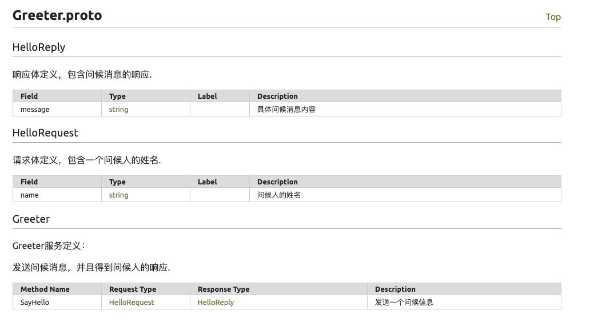
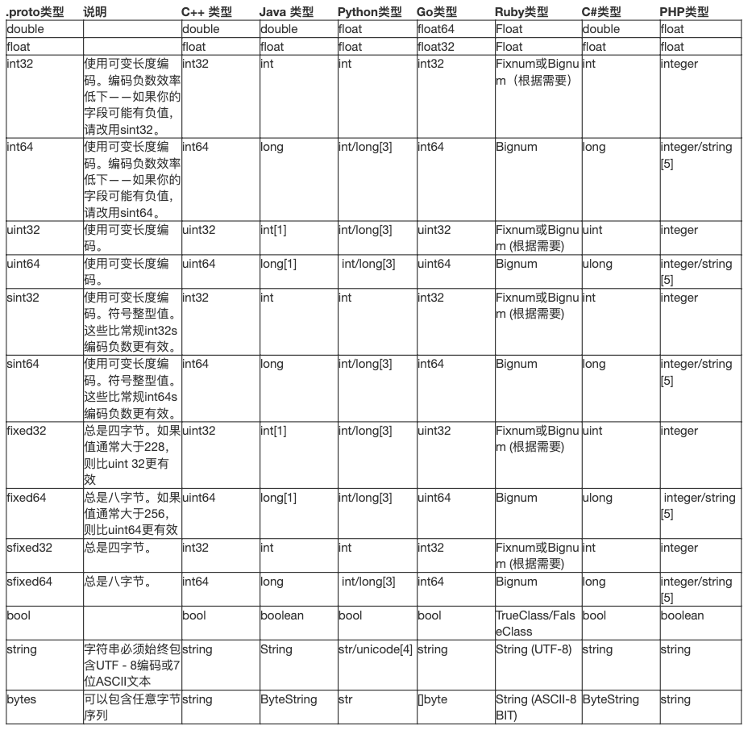
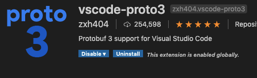

# 前言

Protocol Buffer是Google的语言中立的，平台中立的，可扩展机制的，用于序列化结构化数据 - 对比XML，但更小，更快，更简单。您可以定义数据的结构化，然后可以使用特殊生成的源代码轻松地在各种数据流中使用各种语言编写和读取结构化数据。

# 定义数据类型

## 简单例子

首先让我们看一个非常简单的例子。假设您想要定义搜索请求消息格式，其中每个搜索请求都有一个查询字符串、您感兴趣的特定结果页面以及每页的结果数量。这是用来定义消息类型的.proto文件。

```protobuf
syntax = "proto3";
 
message SearchRequest {
  string query = 1;
  int32 page_number = 2;
  int32 result_per_page = 3;
}
```

该文件的第一行指定您正在使用proto3语法：如果您不这样做，protobuf 编译器将假定您正在使用proto2。这必须是文件的第一个非空的非注释行。

## 分配字段编号

消息定义中的每个字段都有一个唯一的编号。这些字段编号用于以二进制格式标识您的字段，一旦您的消息类型被使用，就不应该被更改。

1到15范围内的字段编号需要一个字节来编码。16到2047范围内的字段编号需要两个字节。

您可以指定的最小字段编号为1，最大字段编号为2^29 - 1，即536,870,911。但是不能使用数字19000到19999 ( FieldDescriptor::kFirstReservedNumber 到FieldDescriptor::kLastReservedNumber)，因为它们是为协议缓冲区实现而保留的-如果您在 .proto文件中使用这些保留的数字之一，协议缓冲区编译器就会报错。同样，您也不能使用任何保留字段。

建议：对于字段编号，一般进行删除或者新增，不进行修改编号。

## 添加更多消息类型

可以在单个.proto中定义多种消息类型。如果您要定义多个相关消息，这很有用——例如，如果您想定义与搜索响应消息类型相对应的回复消息格式，可以将其添加到该.proto中:

```protobuf
message SearchRequest {
  string query = 1;
  int32 page_number = 2;
  int32 result_per_page = 3;
}
 
message SearchResponse {
 ...
}
```

## 添加注释

为你的.proto 添加注释,使用 C/C++风格的 // 或者 /* ... */ 语法。

备注：需要将所有的服务、消息以及字段都增加注释。主要用于自动生成接口文档，需要获取注释信息

一个简单例子：

```protobuf
/* Greeter服务定义：
 * 发送问候消息，并且得到问候人的响应. */
service Greeter {
  // 发送一个问候信息
  rpc SayHello (HelloRequest) returns (HelloReply) {}
}
 
// 请求体定义，包含一个问候人的姓名.
message HelloRequest {
  string name = 1; // 问候人的姓名
}
 
// 响应体定义，包含问候消息的响应.
message HelloReply {
  string message = 1; // 具体问候消息内容
}
```

自动生成接口文档：



## 标量值类型

标量消息字段可以具有以下类型之一——该表显示了.proto文件中指定的类型，以及自动生成的类中的相应类型:



# 特殊数据类型

## 枚举

在下面的例子中，我们添加了一个名为Corpus 的枚举和一个类型为Corpus的字段:

```protobuf
message SearchRequest {
  string query = 1;
  int32 page_number = 2;
  int32 result_per_page = 3;
  enum Corpus {
    UNIVERSAL = 0;
    WEB = 1;
    IMAGES = 2;
    LOCAL = 3;
    NEWS = 4;
    PRODUCTS = 5;
    VIDEO = 6;
  }
  Corpus corpus = 4;
}
```

Corpus枚举的第一个常量映射到0，每个枚举定义必须包含一个映射到零的常量作为第一个元素。这是因为:

-  必须有零值，这样我们就可以使用0作为数值默认值。
-  零值必须为第一个元素，以便与proto 2语义兼容，其中第一个枚举值总是默认的。

踩坑记录：

- 枚举当空值时，默认值为：0


## 使用其他消息类型

您可以使用其他消息类型作为字段类型。例如，假设您希望在每个SearchResponse消息中包含Result消息，为此，您可以在.proto中定义结果消息类型，然后在SearchResponse中指定Result类型字段:

```protobuf
message SearchResponse {
  Result result = 1;
}
 
message Result {
  string url = 1;
  string title = 2;
  repeated string snippets = 3;
}
```

## 嵌套类型

您可以在其他消息类型中定义和使用消息类型，如下例所示:这里Result消息是在SearchResponse消息中定义的:

```protobuf
message SearchResponse {
  message Result {
    string url = 1;
    string title = 2;
    repeated string snippets = 3;
  }
  Result result = 1;
}
```

## Maps类型

如果您想为一个消息创建map字段，其中你可以这样定义它:

```protobuf
message AccountQueryReply {
    string serialNo = 1;
    string msg = 2;
    double amount = 3;
    map<string, string> projects = 4;
}
```

## 数组类型

repeated关键字，字面意思大概是重复的意思，我们可以理解为数组：

```protobuf
message Person {
    string name = 1;    //姓名
    int32 id = 2;       //id
    string email = 3;   //邮件
}
 
message AddressBook {
    repeated Person peoples = 1;
}
```

## wrappers类型

## 包装类

对于基础类型，进行二次封装成包装类：

```protobuf
import "google/protobuf/wrappers.proto";
 
 
// 问候请求信息
message HelloRequest {
    google.protobuf.Int32Value age = 1;
}
```


# IDE插件推荐

使用插件编写Protobuf文件，可以帮忙做简单的语法检，避免出现一些低级错误。不同IDE插件安装如下：

## IDEA插件


## VSCODE插件




参考资料：

google proto官网中文翻译 https://www.kaifaxueyuan.com/basic/protobuf3/scalar-value-types.html