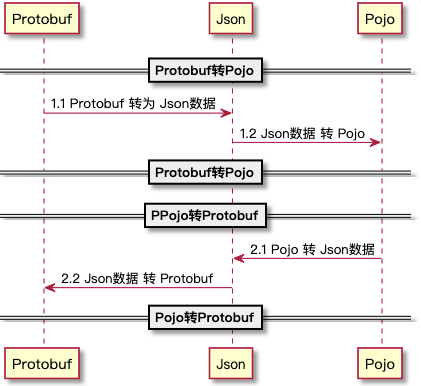

# 前言

在项目中一般会有严格的分层结构，Protobuf作为序列化数据结构的协议，一般对外暴露的接口层可以与Protobuf有较强的依赖，其他业务实现层尽量与协议层相关的东西进行解耦，也方便后续切换协议或者做拓展等。所以我们需要将Protobuf的实体类型转化为具有语言特征的类型。

**备注：**以下涉及的数据与例子，主要以Java编程语言为主，不同语言可以采用类似的方案。

# 解决方案

在为了解决项目过度依赖与Protobuf协议，需要将Protobuf独有的数据类型与Pojo进行转化。Protobuf提供Json互相转化的工具，那我们看到了解决方案的苗头，目前Json技术在不同语言的应用，算是非常广泛的。

可以考虑使用间接转化，我们可以将平台无关语言无关的Json作为中间媒介，先将Protobuf转化为Json，再将Json转化为Pojo即可。反向也是如此：

```
Protobuf <--> Json <--> Pojo
```

具体的转化流程如下所示：

