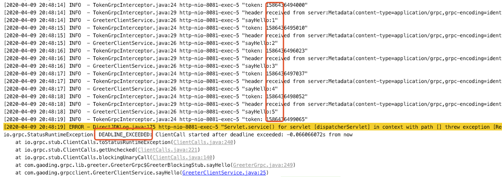
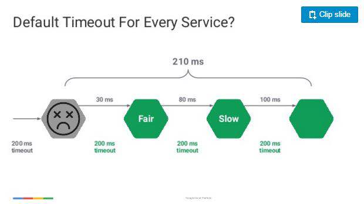
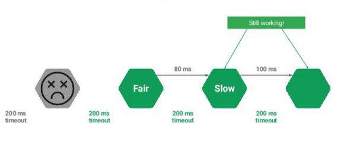
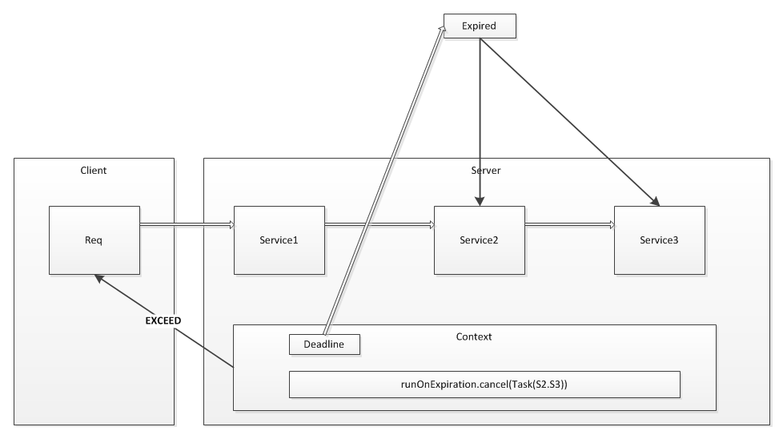
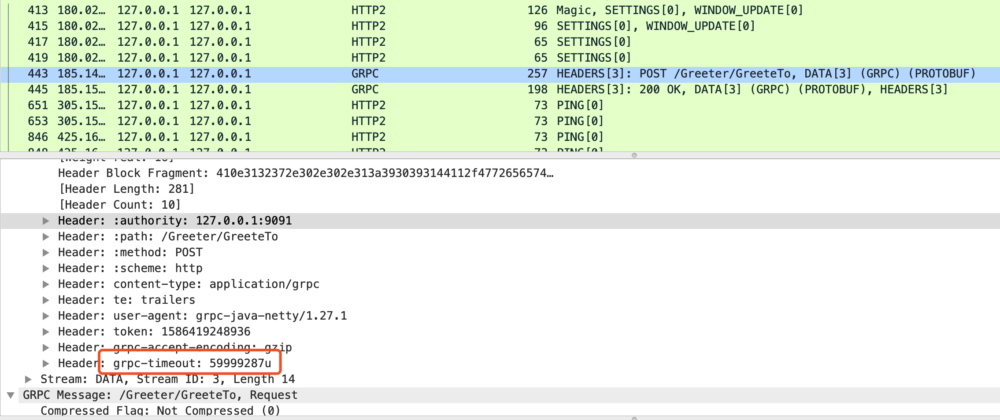

# 1. 前言

在前面的章节中，已经介绍了 gRPC-java 的基本用法。gRPC中没有采用传统的timeout方式去处理，而是采用了Deadline机制。

Deadline核心解决的问题，就是在client请求在遇到异常情况时的最大等待时间，减少不必要的阻塞。实际这个时候server是否返回已经不重要了，因为client已经主动的断开调用了，虽然返回不重要，但是这样会造成很大的资源浪费。

# 2. Deadlines

Deadlines 意指截止时间，在 gRPC 中强调 （Too long, Don't read）并建议始终设定截止时间。

# 3. 设置的作用

当未设置 Deadlines 时，将采用默认的 DEADLINE_EXCEEDED（这个时间非常大） 如果产生了阻塞等待，就会造成大量正在进行的请求都会被保留，并且所有请求都有可能达到最大超时这会使服务面临资源耗尽的风险，例如内存，这会增加服务的延迟，或者在最坏的情况下可能导致整个进程崩溃。

# 4. 举个例子

通过源码看，在 stub 上有 deadline 的设置。但是这个是设置整个 stub 的 deadline，而不是单个请求。

### 针对每次 RPC 请求的超时设置

下面的 .withDeadlineAfter() 会在原有的 stub 基础上新建一个 stub，然后如果我们为每次 RPC 请求都单独创建一个有设置 deadline 的 stub，就可以实现所谓单个 RPC 请求的 timeout 设置。

```java
for (int i=0; i<10; i++) {
    greeterStub.withDeadlineAfter(60, TimeUnit.SECONDS).sayHello();
}
```


底层是信息共享的，创建一个Stub的成本是非常低的，我们可以在每次请求时都通过channel创建新的stub，这并不会带来任何问题（只不过是创建了大量对象）；

其实更好的方式是，我们应该使用一个Stub发送多次请求，即Stub也是可以重用的；直到Stub上的状态异常而无法使用。

### 复用Stub设置一个超时时间

创建一个Stub带有deadline

```java
stub = this.greeterStub.withDeadlineAfter(5, TimeUnit.SECONDS);
```

然后，在循环中调用这个方法

```java
for (int i=0; i<10; i++) {
    // 休眠1s
    Thread.sleep(1000L);
    stub.doSomething();
}
```

执行后，执行过程中，我将日志进行打出，如下图所示



结果发现：前面4次的调用都正常返回，其他的请求，开始抛出DEADLINE_EXCEEDED的异常信息，观察我打出的日志来看，刚好前面5次请求，花了5s时间。

所以，可以确认deadline参数是作用在整个stub上的。

### 服务端判断Deadline

作为server端，如果client端设置了超时，server端就需要去检测下，否则如果client端已经超时了，服务端还继续运行，那岂不是浪费server端的资源。

java端检测代码如下：

```java
if (Context.current().isCancelled()) {
  responseObserver.onError(Status.CANCELLED.withDescription("Cancelled by client").asRuntimeException());
  return;
}
```

一般而言，server在拿到request之后就应该检测client的超时时间，如果超时了，就不在执行逻辑。不过，如果在server开始执行逻辑但并没有结束的时候client超时了怎么办，当然可以在server执行逻辑的同时检测是否超时，如果超时，cancel掉逻辑。但是也有特殊情况，比如这个逻辑很耗费资源，但是结果对客户端而言是可重用的，或者说结果是可以缓存的，那么就需要把结果保存下来，别cancel逻辑了。具体还是根据业务情况来定。

#  5. gRPC 超时如何做到跨进程传递



设置超时时长为200毫秒，这时需要调用三个服务A/B/C，当处理到B的时候，已经超时了，这时client会抛出DEADLINE_EXCEEDED异常，但是这时请注意，只有client一端响应，实际server端还在工作！



实际这个时候server是否返回已经不重要了，因为client已经主动的断开调用了，虽然返回不重要，但是这样会造成很大的资源浪费。
实际看到这，Deadline的要解决的核心问题已经暴露出来了，就是如何两端同步超时时间，如何将超时传播给其他（等待）服务。


下图为gRPC跨进程间超时机制



gRPC的设计思路：

- 当client产生请求时，将request中的deadline绑定到context，并启动一个定时任务，执行时间为当前时间+deadline时间。
- service按照依赖关系依次运行，如果超出deadline规定的时间，执行cancel任务，包括中断当前task，清除所有listeners等。
- 向client返回exceed异常, 通知超时，client结束等待。

### 那么 gRPC 的超时是如何做到跨进程跨语言传递的？

我们知道 gRPC 基于 HTTP2，HTTP2 传输的最小单位是 Frame（帧）。HTTP2 的帧包含很多类型：“DATA Frame”、“HEADERS Frame”等。一个 HTTP2 请求/响应可以被拆成多个帧并行发送，每一帧都有一个 StreamID 来标记属于哪个 Stream。服务端收到 Frame 后，根据 StreamID 组装出原始请求数据。

对于 gRPC 而言，Data Frame 用来存放请求的 response payload；Headers Frame 可用来存放一些需要进行跨进程传递的数据，比如“grpc-status（RPC 请求状态码）”、“:path（RPC 完整路径）”等。

可以看到客户端发起请求时，如果设置了带 deadline 的stub，则会导致底层 HTTP2 HEADERS Frame 中追加“grpc-timeout”字段。



至此可以看到，gRPC 框架确实是通过 HTTP2 HEADERS Frame 中的 “grpc-timeout”字段来实现跨进程传递超时时间。

# 6. 总结

- 客户端客户端发起 RPC 调用时传入了带 deadline 的 Stub
- gRPC 框架底层通过 HTTP2 协议发送 RPC 请求时，将 deadline 值写入到 "grpc-timeout"HEADERS Frame 中
- 服务端接收 RPC 请求时，gRPC 框架底层解析 HTTP2 HEADERS 帧，读取 “grpc-timeout”值，并覆盖透传到实际处理 RPC 请求的业务 gPRC Handle 中
- 如果此时服务端又发起对其他 gRPC 服务的调用，且使用的是透传的 Context，这个 deadline 会减去在本进程中耗时，从而导致这个 deadline 传递到下一个 gRPC 服务端时变短，这样即实现了所谓的 "超时传递" 


参考资料

Grpc中Deadline分析 https://www.jianshu.com/p/f67be6287c1d

How does deadline work? https://github.com/grpc/grpc-java/issues/1495

https://grpc.io/blog/deadlines