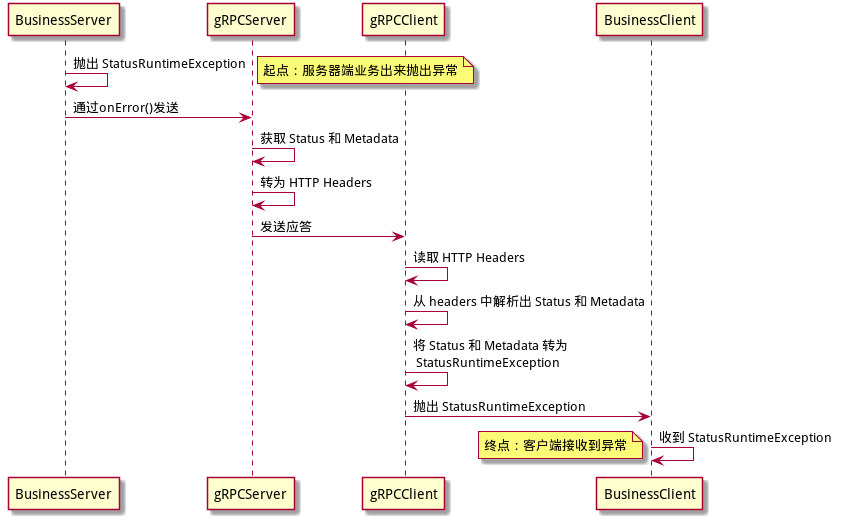

# 异常处理流程

gRPC通过 Status 和 Metadata 来传递异常信息，服务器端抛出异常到客户端的过程，实际是对 异常 和 Status/Metadata 的传递和转换的过程：

- 服务器端抛出异常
- 异常转为 Status/Metadata
- Status/Metadata 传递到客户端
- 客户端将 Status/Metadata 转回异常

Status/Metadata 在服务器端和客户端的传输中，是通过 HTTP header 来实现的。

gRPC异常处理流程，如下所示：



最终实现的目标：当服务器端抛出异常时，客户端就会抛出对应的异常

# **服务端异常处理**

## **JAVA处理方式**

虽然 gRPC 官方推荐用 onError() 处理异常，但是实际上在实践时需要每个业务方法都要来一个大的 try catch 。这使得代码冗余而烦琐。

解决的方式，是自己写一个 ServerInterceptor， 实现一个 `io.grpc.ServerCall.Listener` 来统一处理

```java
public class GrpcExceptionInterceptor implements ServerInterceptor {
 
    @Override
    public <ReqT, RespT> ServerCall.Listener<ReqT> interceptCall(ServerCall<ReqT, RespT> call,
                                                                 Metadata requestHeaders, ServerCallHandler<ReqT, RespT> next) {
        ServerCall.Listener<ReqT> delegate = next.startCall(call, requestHeaders);
        return new ForwardingServerCallListener.SimpleForwardingServerCallListener<ReqT>(delegate) {
            @Override
            public void onHalfClose() {
                try {
                    super.onHalfClose();
                } catch (Exception e) {
                    call.close(Status.INTERNAL
                            .withCause (e)
                            .withDescription("error message"), new Metadata());
                  
                }
            }
        };
    }
}
```