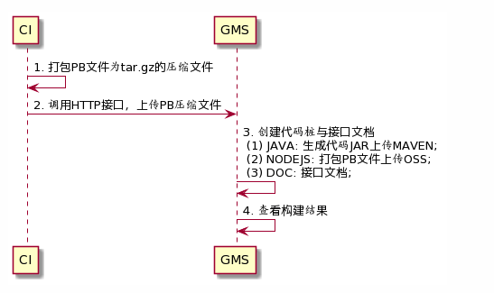
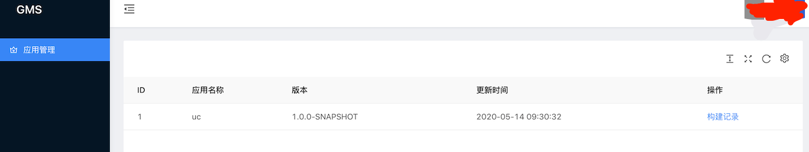
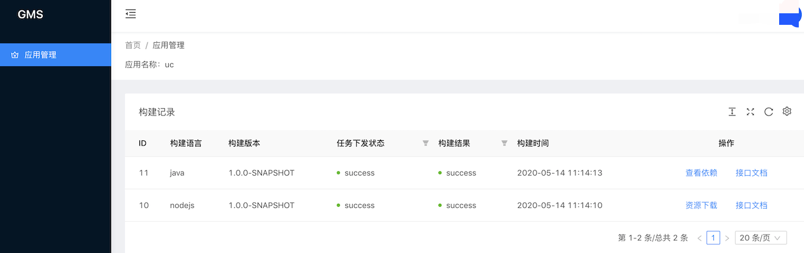

# 1. 前言

## 支持语言

java，nodejs

## 名词解释

**应用：**对应一个微服务的概念，e.g. ums、oms（一个应用对应一个Proto文件仓库）。

**应用名称：**应用的名称，e.g. ums、oms，为应用的名称。

**GMS：**GMS是统一管理Protobuf文件，并进行自动化构建不同语言的代码桩的平台。并且提供UI，对构建过程进行可视化，同时可通过界面查看构建结果，同时可以支持在线查看接口文档。

**PB：**protobuf简称

# 2. 接入指南

## 主流程

具体流程如下图所示：



流程说明：

1. 将PB文件打包成tar.gz压缩文件
2. 调用HTTP接口，发送PB压缩文件给GMS平台；
3. GMS接收到构建任务后，根据配置生成不同的代码桩；
4. 代码桩生成后，在界面支持下载以及接口文档查看；

## 第一步： 新增CI流程

一个应用有对应一个PB文件目录。我们以UserCenter（简称：uc）为例子

在代码工程目录下有proto文件目录，如下所示：


**CI添加以下步骤**

**方法一：直接传入版本号**

```sh
// 构建
stage('gRPC-Proto-Upload') {
    when(['dev'].contains(env.BRANCH_NAME)) {
      sh '''
         # ci-pb-pack -d ${protofilesDir} -n ${appName} -v ${version}
         pb-pack -d ./src/main/proto -n uc-api -v 1.0.0-1
      '''
    }
}
```

**方法二：传入配置文件，目前支持java与nodejs的配置文件解析**

```sh
// 构建
stage('gRPC-Proto-Upload') {
    when(['dev'].contains(env.DIND_RUNTIME_ENV_NAME)) {
      sh '''
         # ci-pb-pack -d ${protofilesDir} -n ${appName} -f ${configFile} -e ${env}
         # java
         ci-pb-pack -d ./src/main/proto -n uc-api -f ./pom.xml -e ${DIND_RUNTIME_ENV_NAME}
          
         # nodejs
         ci-pb-pack -d ./src/main/proto -n uc-api -f ./package.json -e ${DIND_RUNTIME_ENV_NAME}
      '''
    }
}
```


**备注：**

（1）protofilesDir：PB压缩文件的路径（**必填**）。
（2）appName：当前应用的名称（**必填**）。
（3）version当前应用的版本号（选**填**）。说明：如果为dev的测试版本，版本号后需要增加-SNAPSHOT(e.g. 1.0.0-SNAPSHOT), 主要用于满足JAVA的快照版本

（4）configFile对应项目的配置文件（选填）。说明：java对应pom.xml，nodejs对应package.json


**友情提示：**

Protobuf文件定义，需要补充完整的注释信息，方便接口文档的自动生成


## 第二步：查看应用信息

触发构建后，在界面上可以查看，触发构建的应用列表。

可以查看到uc-pb-lib的应用记录，如下图所示：




## 第三步：获取代码桩

在应用管理中，点击构建记录，进入构建记录列表：如下所示：



**代码桩获取方式：**

- java：点击“查看依赖”，可以查看对应的依赖引入方法
- 其他语言：点击资源下载，直接下载对应的代码桩或者protobuf文件